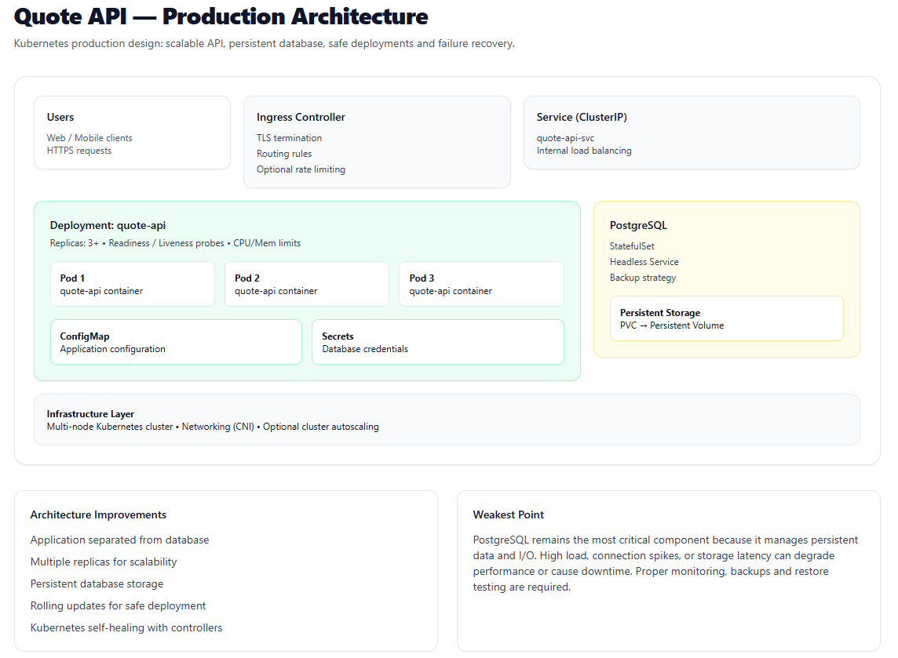

# Current System Problems

## 1) Pod unique: application + PostgreSQL dans le même conteneur
**Problème**  
Application et base partagent le même cycle de vie (un seul conteneur / un seul pod effectif).

**Pourquoi c’est critique**  
Le besoin de scaler l’API et le besoin de stabilité de la base sont opposés. La base doit rester stable, l’API doit pouvoir scaler horizontalement. Mélanger les deux empêche une isolation correcte des pannes et des ressources.

**Risque opérationnel / panne**  
- Une montée en charge de l’API peut affamer PostgreSQL (CPU/RAM/IO) → latence, timeouts, corruption possible en cas d’OOM/kill.  
- Redéploiement de l’API = redémarrage de PostgreSQL → indisponibilité + risque de perte de données si l’écriture disque n’est pas durable.

## 2) Persistance non fiable
**Problème**  
PostgreSQL “dans le pod” est souvent couplé à un stockage éphémère ou mal provisionné.

**Pourquoi c’est critique**  
Une base en production doit avoir une durabilité garantie (PV/PVC), des sauvegardes, et un plan de restauration.

**Risque opérationnel / panne**  
- Perte totale des données lors d’un rescheduling, d’une suppression de pod, d’un crash nœud.  
- Restauration lente ou impossible sans backups testés.

## 3) Secrets en variables d’environnement en clair
**Problème**  
Les identifiants DB et autres secrets sont exposés en clair (manifests, historiques CI, logs, outils de debug).

**Pourquoi c’est critique**  
Les secrets finissent copiés partout (Git, CI/CD, tickets, captures d’écran). Le blast radius est élevé.

**Risque opérationnel / panne**  
- Compromission des credentials → exfiltration / modification des données.  
- Rotation de secret difficile → indisponibilités si l’app ne recharge pas correctement.

## 4) Dépendance à un seul nœud
**Problème**  
Le système n’est pas tolérant à la panne nœud (single point of failure).

**Pourquoi c’est critique**  
Une panne nœud est un évènement normal (maintenance, kernel, disque, réseau).

**Risque opérationnel / panne**  
- Indisponibilité totale pendant la reconstruction.  
- Risque de perte de données si DB stockée localement.

## 5) Absence de probes (readiness/liveness)
**Problème**  
Kubernetes ne sait pas si l’application est prête ni si elle est bloquée.

**Pourquoi c’est critique**  
Sans readiness, du trafic va vers des pods non prêts. Sans liveness, des pods deadlocked restent “vivants”.

**Risque opérationnel / panne**  
- Dégradation silencieuse, erreurs 5xx intermittentes.  
- Récupération non automatique d’états bloqués.

## 6) Pas de requests/limits, rollouts dangereux
**Problème**  
Sans requests/limits, le scheduler place mal les pods et les OOMKills deviennent probabilistes. Un rollout qui remplace “immédiatement” augmente le risque de blackout.

**Pourquoi c’est critique**  
Le capacity planning et la stabilité dépendent de ressources déclarées, et les mises à jour doivent préserver la capacité.

**Risque opérationnel / panne**  
- Contention CPU/RAM → pics de latence, crashs.  
- Pendant un déploiement, disparition de toute capacité si les nouveaux pods ne deviennent pas prêts.

# Production Architecture

## Objectifs explicites
- API stateless et scalable horizontalement.
- Base persistante, isolée, sauvegardée.
- Mises à jour progressives, réversibles.
- Détection et récupération automatique des pannes.
- Sécurité minimale: secrets gérés, TLS, moindre privilège.

## Composants Kubernetes

### 1) Quote API (stateless)
- **Deployment** `quote-api`
  - `replicas: 3` (minimum), **HPA** sur CPU et/ou RPS
  - **Readiness probe**: endpoint `/ready` (ou healthcheck DB + dépendances critiques)
  - **Liveness probe**: endpoint `/healthz` (process vivant, pas de dépendance externe)
  - **Requests/Limits** CPU/RAM (évite noisy-neighbor + améliore scheduling)
  - **PodDisruptionBudget**: `minAvailable: 2`
  - **Anti-affinity** préférée: répartir les replicas sur nœuds distincts
  - **SecurityContext**: non-root, readOnlyRootFilesystem si possible

- **Service (ClusterIP)** `quote-api-svc`
  - Load-balancing interne vers les pods

- **Ingress**
  - Terminaison TLS (cert-manager)
  - Règles de routage vers `quote-api-svc`
  - Option: rate limiting (ingress-nginx / envoy / traefik selon stack)

### 2) PostgreSQL (stateful)
Deux options acceptables en production; la différence est l’effort opérationnel.

**Option A — StatefulSet “géré maison” (simple, mais responsabilité élevée)**
- **StatefulSet** `postgres`
  - `volumeClaimTemplate` → **PVC** (StorageClass dynamique)
  - **Service headless** pour identité stable
  - Probes adaptées PostgreSQL (startup/readiness)
  - Ressources CPU/RAM et, si possible, QoS garantie
- Backups: job/schedule + stockage objet, restauration testée

**Option B — Opérateur PostgreSQL (préférable si disponible)**
- Opérateur (ex: CloudNativePG / Zalando / Crunchy) pour:
  - sauvegardes, PITR, réplication, failover, rotation secrets
  - politiques de maintenance standardisées
- Réduit fortement le risque humain, au prix d’une dépendance opérateur.

### 3) Secrets et configuration
- **Secrets Kubernetes** pour credentials DB (pas dans les manifests en clair)
- **ConfigMap** pour la config non sensible
- Option sécurité renforcée:
  - CSI Secrets Store + Vault/KMS du cloud pour éviter les secrets statiques dans etcd

### 4) Rollout sûr
- Deployment strategy: **RollingUpdate**
  - `maxUnavailable: 0`
  - `maxSurge: 1` (ou 25%)
- `readinessProbe` obligatoire: un pod ne reçoit pas de trafic tant qu’il n’est pas prêt
- **Rollback** via `kubectl rollout undo` (ou via CD)

# Operational Strategy

## Scaling
- **Horizontal Pod Autoscaler** augmente les replicas du Deployment `quote-api` selon métriques (CPU, latence, RPS si métriques applicatives).
- Le Service répartit la charge automatiquement.
- La base **ne scale pas** horizontalement “gratuitement”. La montée en charge DB se traite par:
  - indexation, tuning, pool de connexions (PgBouncer), cache applicatif si pertinent
  - read replicas si l’opérateur le supporte et si la charge est majoritairement en lecture

## Déploiements sûrs
- RollingUpdate avec `maxUnavailable: 0` + readiness
- **Migrations DB**:
  - exécution contrôlée (Job Kubernetes) avant rollout ou étape CI/CD
  - migrations backward-compatible quand possible (expand/contract)
- Canari optionnel via deux Deployments et routing Ingress (si l’équipe a l’outillage)

## Détection des pannes
- Readiness: évite d’envoyer du trafic aux pods non prêts.
- Liveness: redémarre les pods bloqués.
- Alerting/observabilité (minimum):
  - métriques (Prometheus), logs (ELK/Loki), traces (OTel)
  - SLO centrés utilisateur: taux d’erreur, latence p95/p99, saturation ressources

## Contrôleurs Kubernetes responsables de la récupération
- **Deployment/ReplicaSet**: recrée les pods applicatifs en cas de crash/éviction.
- **HPA**: ajuste le nombre de replicas.
- **StatefulSet**: maintient l’identité du pod DB et rattache le PVC.
- **Scheduler**: re-place les pods sur nœuds disponibles.
- **kubelet**: applique probes et redémarre conteneurs.
- **Ingress controller**: applique la config de routage externe.

# Weakest Point

La base PostgreSQL est le point le plus fragile: état, IO, sauvegardes, restauration, et risque d’erreur humaine.  
Le premier mode de défaillance sous stress est typiquement la saturation DB (connexions, locks, IO) ou une restauration non testée. La mitigation réelle est l’automatisation (opérateur), des backups vérifiés, et des tests réguliers de restauration.
